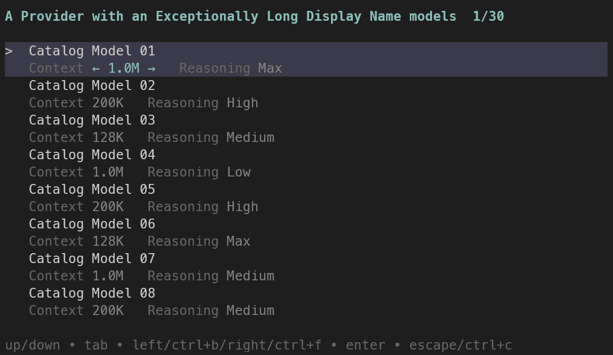
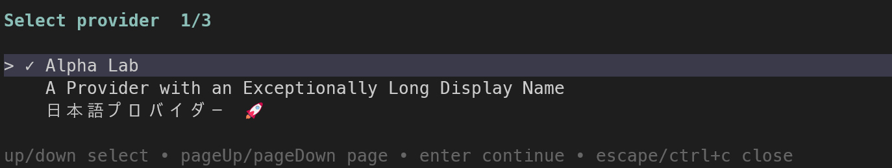
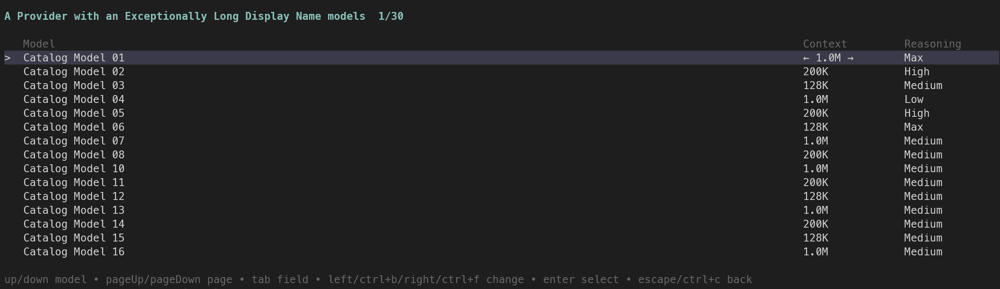

# pi-unified-model-picker

[](https://github.com/perbellinioa/pi-unified-model-picker/actions/workflows/ci.yml)
[](https://www.npmjs.com/package/pi-unified-model-picker)
[](LICENSE)

A provider-agnostic model picker for [pi](https://github.com/earendil-works/pi-mono). Choose a provider, model, local context budget, and supported reasoning level through a compact keyboard-driven flow.



## Features

- Models from every configured provider
- Skips provider selection when only one provider is configured
- Respects pi's scoped-model configuration
- Model, context, and reasoning selection in one lean model screen
- Reasoning levels from pi's native `getSupportedThinkingLevels()` API
- Safe context options that never exceed the advertised model window
- Recent-model ordering persisted locally through a serialized atomic writer
- Revision- and width-aware render caching
- Responsive wide/narrow layouts with overflow checks from 1 through 500 cells and heights from 6 through 80 rows
- One-step selection through `/model-picker`

> **Context budget:** this changes pi's local context/compaction budget for the currently selected model. It does not change the remote model's actual context window, and it resets when a later model switch or new session restores the catalog model. The picker never offers a budget above the advertised maximum.

## Screenshots

### Provider selection



### Wide model selection



### Compact model selection


## Requirements

- pi 0.84 or newer
- Node.js 22.19 or newer
- Interactive TUI mode

## Install

From npm after publication:

```bash
pi install npm:pi-unified-model-picker
```

From GitHub:

```bash
pi install git:github.com/perbellinioa/pi-unified-model-picker
```

For local development:

```bash
pi install /absolute/path/to/pi-unified-model-picker
```

Then run `/reload` in an existing pi session.

## Usage

Open the picker:

```text
/model-picker
```

Keys:

| Key | Action |
| --- | --- |
| `↑` / `↓` | Select a provider or model |
| `Page Up` / `Page Down` | Move by one visible page |
| `Tab` | Switch between context and reasoning |
| `←` / `→` | Change the active context or reasoning value |
| `Enter` | Continue from provider selection or apply the model selection |
| `Esc` / `Ctrl+C` | Return to provider selection, or close the picker |

These actions honor pi's configured `tui.select.*`, `tui.input.tab`, and cursor keybindings rather than assuming the defaults.

Recent-model history is stored in:

```text
~/.pi/agent/pi-unified-model-picker/history.json
```

It contains only provider and model identifiers—no credentials.

## Development

```bash
npm install
npm run validate
npm run benchmark
npm run test:ui
```

The test suite includes state transitions, concurrent history writes, render-cache invalidation, ANSI selection styling, Unicode and long-name handling, exact golden output at 40/77/78/120 cells, alignment assertions, and line-width invariants for both adjustable fields and both screens from 1 through 500 cells, plus viewport-height bounds from 6 through 80 rows.

`npm run test:ui` launches pi in an isolated temporary agent directory with three no-network fixture providers: a single-model provider, a 30-model catalog with long names and mixed capabilities, and a Unicode provider. It cannot alter normal pi settings and starts in offline mode. Press Enter on the prefilled `/model-picker` command to begin; exit after UI testing rather than submitting a normal model prompt, since fixture endpoints are intentionally unreachable. See [BENCHMARKS.md](BENCHMARKS.md) for measured baselines.

The package uses pi's current APIs:

- `@earendil-works/pi-ai`
- `@earendil-works/pi-coding-agent`
- `@earendil-works/pi-tui`

## Design principles

- Provider-neutral: discovery and authentication remain the responsibility of pi and provider extensions.
- Non-invasive: the picker does not register or replace providers.
- Capability-aware: reasoning choices come from the selected model definition.
- Fluid navigation: provider selection is a separate screen and is skipped when unnecessary.
- Honest context controls: selectable context values never exceed the provider's advertised model window.

## Contributing and security

See [CONTRIBUTING.md](CONTRIBUTING.md) for development expectations and [RELEASING.md](RELEASING.md) for the trusted publication process. Report vulnerabilities according to [SECURITY.md](SECURITY.md), not through public issues.

## License

MIT
