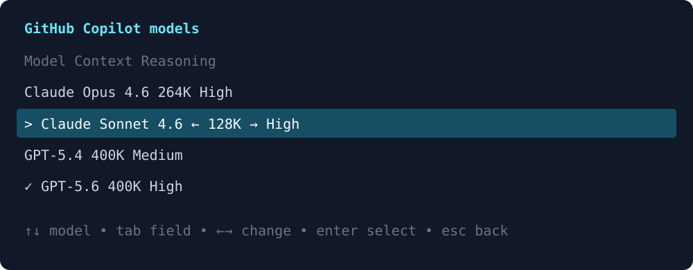

# pi-unified-model-picker

A provider-agnostic model picker for [pi](https://github.com/earendil-works/pi-mono). Choose the provider, model, local context budget, and supported reasoning level in one terminal screen.



## Features

- Models from every configured provider
- Skips provider selection when only one provider is configured
- Respects pi's scoped-model configuration
- Model, context, and reasoning selection in one lean screen
- Reasoning levels from pi's native `getSupportedThinkingLevels()` API
- Safe context options that never exceed the advertised model window
- Recent-model ordering persisted locally
- One-step selection through `/model-picker`

> **Context budget:** this changes pi's local context/compaction budget for the selected model. It does not change the remote model's actual context window. The picker never offers a budget above the model's advertised maximum.

## Requirements

- pi 0.84 or newer
- Node.js 20 or newer
- Interactive TUI mode

## Install

From npm after publication:

```bash
pi install npm:pi-unified-model-picker
```

From GitHub:

```bash
pi install git:github.com/perbellinioa/pi-unified-model-picker
```

For local development:

```bash
pi install /absolute/path/to/pi-unified-model-picker
```

Then run `/reload` in an existing pi session.

## Usage

Open the picker:

```text
/model-picker
```

Keys:

| Key | Action |
| --- | --- |
| `↑` / `↓` | Select a provider or model |
| `Tab` / `Shift+Tab` | Switch between context and reasoning |
| `←` / `→` | Change the active context or reasoning value |
| `Enter` | Continue from provider selection or apply the model selection |
| `Esc` | Return to provider selection, or close the picker |

Recent-model history is stored in:

```text
~/.pi/agent/pi-unified-model-picker/history.json
```

It contains only provider and model identifiers—no credentials.

## Development

```bash
npm install
npm run validate
```

The package uses pi's current APIs:

- `@earendil-works/pi-ai`
- `@earendil-works/pi-coding-agent`
- `@earendil-works/pi-tui`

## Design principles

- Provider-neutral: discovery and authentication remain the responsibility of pi and provider extensions.
- Non-invasive: the picker does not register or replace providers.
- Capability-aware: reasoning choices come from the selected model definition.
- Fluid navigation: provider selection is a separate screen and is skipped when unnecessary.
- Honest context controls: selectable context values never exceed the provider's advertised model window.

## License

MIT
